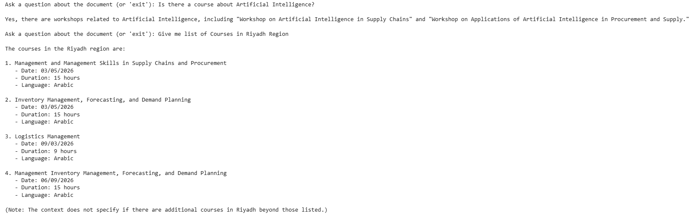

# Course Assistant (RAG)
**Retrieval-Augmented Generation (RAG)** application that helps students ask questions about their course Information.

- **Courses:** Modern Data Engineering for Advanced AI Systems, [SDAIA Academy](https://github.com/SDAIAAcademy) 
- **Author:** Shahad Almanqur - Data Scientist

## Features

- Upload course PDFs
- Extract and split course content
- Create embeddings and store them in ChromaDB
- Ask questions about course materials
- Retrieve relevant course content
- Generate answers with source references
- Support multiple courses

## Technologies

- Python
- FastAPI
- OpenRouter
- ChromaDB
- PyPDF
## How it works
Course PDF
    ↓
Text Extraction
    ↓
Text Chunking
    ↓
Embeddings
    ↓
ChromaDB
    ↓
Student Question
    ↓
Relevant Content Retrieval
    ↓
LLM
    ↓
Answer + Sources

## Example Question

